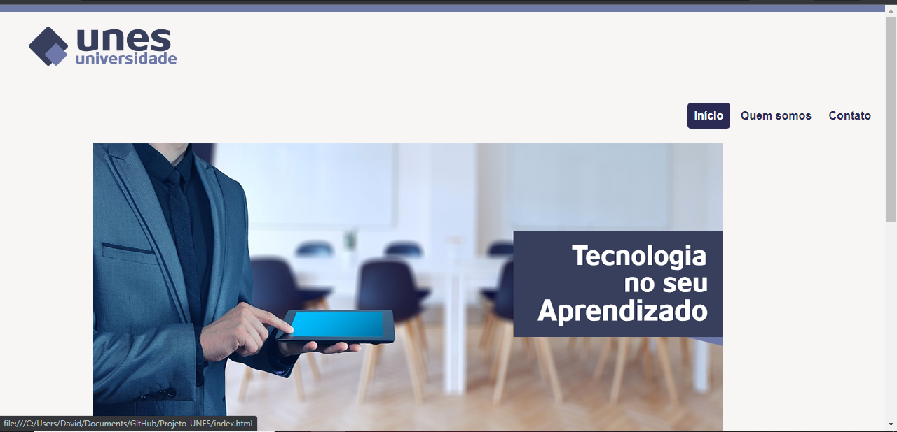

# Projeto-UNES

O site tem uma página de início que contém informações sobre a universidade fictícia e conta também com menu de navegação que ao clicar redireciona para outra página do site.

### Início:
A página inicial contém a logo da universidade, uma imagem de uma sala de aula e conta também com informações sobre a UNES.

### Quem somos:
A segunda opção do menu de navegação é "Quem somos", que ao clicar redireciona para a segunda página do site, contendo mais informações sobre a universidade, com uma lista de cinco motivos para estudar na UNES e também fala sobre os objetivos da mesma.

### Contato:
A terceira opção do menu de navegação é "Contato", que ao clicar redireciona para a terceira página do site, informando como entrar em contato através do preenchimento de um pequeno formulário.

## Feito Com:

Copyright © DavidWillian

